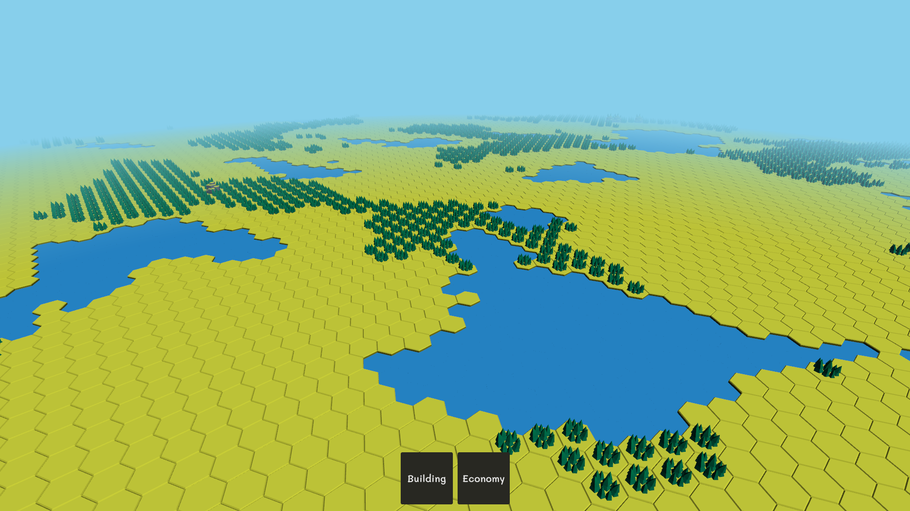
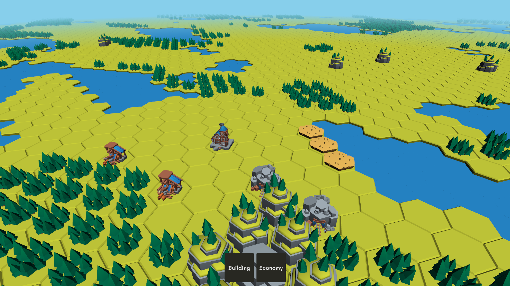
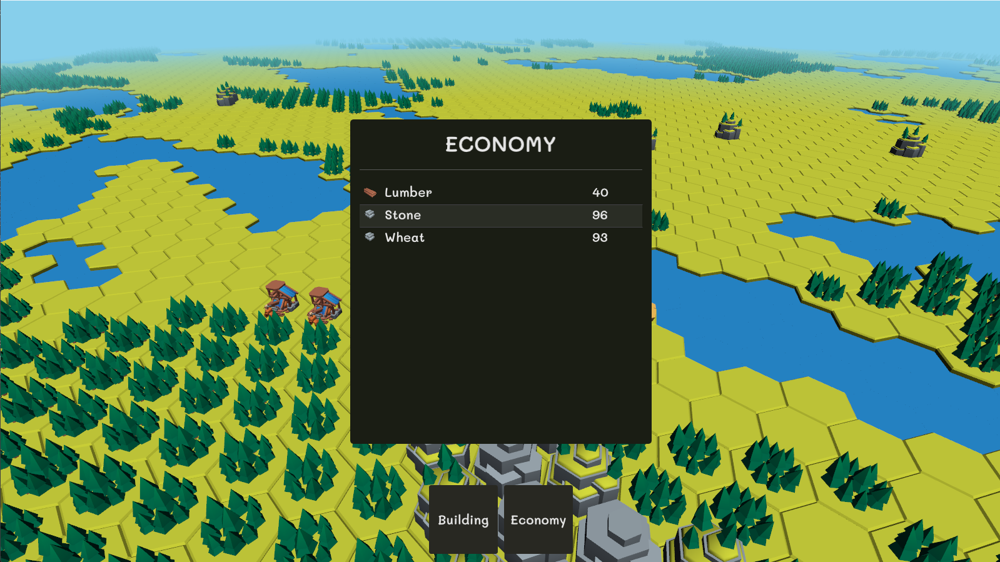

# Realm Fortress

**Realm Fortress** is a strategy game developed in C++ where
players build and manage settlements on an infinite world. 
The game focuses on resource management and city-building mechanics, 
built from scratch using OpenGL and a custom engine architecture.

## Features
- **Infinite World Generation:** Explore a boundless world procedurally generated using Perlin Noise, featuring diverse biomes such as grasslands, water bodies, forests, and mountains.
- **Chunk-based System:** An optimized chunk management system ensures smooth rendering and processing, allowing for seamless exploration of new areas.
- **City Building:** Construct various buildings like Townhalls, Lumber Mills, Mines, and Farms to gather resources and expand your territory.
- **Resource Management:** Manage essential resources including Lumber, Stone, and Wheat to grow your empire.
- **Dynamic Economy:** Buildings interact with their environment (e.g., Lumber Mills work better near forests) and feature a logistics system connected to the town center.
- **Custom Game Engine:** Developed from the ground up. 
  - **Rendering:** Utilizes Modern OpenGL (4.6) with Instanced Rendering for high performance.
  - **Shaders:** Custom shaders for lighting, distance fog, and selection effects.
  - **UI:** Integrated Dear ImGui for menus and information panels.

## Tech Stack
- **Language:** C++23
- **Graphics API:** OpenGL 4.6 (via GLAD)
- **Windowing:** GLFW

## Gallery
### Infinite World & Biome


### Building System


### Resource & Economy


### Gameplay Demo
[gameplay](https://youtu.be/dpIsZu5e81Q)

## How to Build & Run
1. **Clone repository:**
```bash
git clone https://github.com/tanapatnamsomboon/realm-fortress.git
cd realm-fortress
```
2. **Prerequisites:**
- CMake (3.25+)
- C++ Compiler (MSVC, GCC, or Clang)
- OpenGL Dirvers
- other
3. **Build Steps:**
```bash
mkdir build && cd build
cmake ..
cmake --build . --config Release
```
4. **Run:**
- Navigate to the output directory (e.g., bin/Release) and run realm-fortress.exe

## Play the Game
👉 itch.io page: https://tanapatnams.itch.io/realm-fortress

## Attribution
See [attribution.md](attribution.md)
